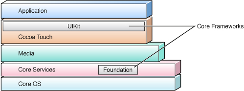

# iOS 框架结构

在系统中的位置, 由上到下依次是:

| Framework     | Sub Framework                            |
| ------------- | ---------------------------------------- |
| Application   |                                          |
| Cocoa Touch   | UIKit                                    |
| Media         | Core Graphics, OpenGL ES, Core Animation |
| Core Services | Core Data, Foundation                    |
| Core OS       |                                          |

# UIKit

UIKit 提供基于预渲染图形的视图和控件, 在屏幕上绘制的机制, 捕获事件和创建通用用户界面元素, 通过管理显示在屏幕上的组件来组织复杂的项目

UIKit 的功能

1. 构建和管理你的用户界面
2. 捕获触摸和基于移动的事件
3. 呈现文字和web内容
4. 优化你的多任务程序
5. 创建定制的用户界面元素

UIKit 的使用

1. 在用户界面工具(interface Buidler)从对象库里拖拽窗口, 视图或者其他的对象使用
2. 用代码创建
3. 通过继承 UIView 类或间接继承 UIView 类实现自定义用户界面
4. UIResponder 为处理响应事件和响应链定义了界面和默认行为, 当用户用手指滚动列表或者在虚拟键盘上输入时, UIKit 就生成时间传送给 UIResponder 响应链, 直到链中有对象处理这个事件

# Core Graphics

Core Graphics 提供了更底层的库创建复杂的图形

Core Graphics 的功能

1. 创建基于路径的绘图
2. 抗锯齿渲染
3. 添加梯度、图片和颜色
4. Use coordinate-space transformations.
5. 创建、显示和分析PDF文档

# OpenGL ES

OpenGL ES 提供绘图工具, 支持2D和3D绘图，Apple 的 OpenGL ES 实现通过硬件提供了高速的全屏游戏式的应用程序

OpenGL ES 的功能

1. 创建2D和3D图形
2. 创建更复杂的图形，比如数据虚拟化、模拟飞行，或者视频游戏
3. 访问底层图形设备

# Core Animation

1. Core Animation 接口包含在 Quartz Core 框架里, 允许你创建高级的动画和虚拟效果, UIKit 提供建立在 Core Animation 之上的动画。
2. Core Animation 可以创建嵌套的对象，并且可以对它们操作、旋转、缩放和转换, 创建动态的用户界面而不用使用更底层的图形API，如OpenGL ES。

Core Animation 的功能

1. 创建定制动画
2. 添加定时函数和图形
3. 支持帧动画
4. Specify graphical layout constraints.
5. Group multiple-layer changes into anatomic update.

# Core Data

1. Core Data 框架管着理应用程序数据模型, 创建模型对象，并管理这些对象间的联系并修改数据
2. Core Data 提供的内建 SQLlite 技术可以高效的管理数据
3. 苹果自带的数据库

Core Data 的功能

1. 在库里存储和接收对象
2. 提供基本的 undo/redo
3. 自动验证属性值
4. 过滤、分组和优化内存中的数据
5. 用[NSFetchedResultsController]管理表视图中的结果
6. 支持基于文档的应用程序

# Foundation

1. Foundation 框架为所有的应用程序提供基本系统服务, 应用程序, UIKit 和其它的框架都建立在Foundation框架上
2. Foundation 框架是用 Object-C 对 Core Foundation 框架里许多特性的封装

Foundation 的功能

1. 创建和管理集合，比如数组和字典
2. 访问存储在应用程序里的图片和其它资源
3. 创建和管理字符串
4. 提交和接收通知
5. 创建日期和时间对象
6. 自动发现IP网络上的设备
7. 操作URL流
8. 执行异步代码

# 概述

1. Mac OS X 原生面向对象的五大 API: Cocoa, Carbon, POSIX, X11, Java
2. kit 指动态运行库
3. 使用 Cocoa 编程环境开发的应用程序即为 Cocoa 应用. 这类应用有独特的外观, 因为 Cocoa 编程环境让程序在多方面自动遵循苹果公司的人机界面守则

# Framework

1. 框架: 框架就是一组由许多类, 方法, 函数和文档按照一定的逻辑组织起来的集合, 本质是一个目录, 包含: 共享库及其头文件, 图片和声音等资源文件
2. 框架的引用: 根据项目模板，相关的框架会被自动引入, 还可以手动添加, 将共享库添加到项目中, 即可使用该框架提供的方法和函数
3. 举例: Foundation, UIKit, Core Graphics

# Cocoa

1. Cocoa 是在 Mac OS X 系统上原生的一个编译环境, 支持多种编程语言, 是面向对象的接口, 前身是 NeXTSTEP 和 OpenStep
2. Cocoa 包含2个框架(类库): Foundation, AppKit, 还有 Core Data 第三方框架
3. Cocoa 程序是由一些对象组成, 而这些对象的类最后都是继承于它们的根类: NSObject, 而且都基于 OC 运行环境
4. AppKit 框架是 Mac OS X 上的用户图形包, 类名以 NS 开头

# Cocoa Touch

1. Cocoa Touch 是 Cocoa 的子类, 用于 iOS 设备, 属于 iOS SDK
2. Cocoa Touch 包含2个框架(类库): Foundation, UIKit, 还有 Core Data 第三方框架
3. Cocoa Touch 不支持垃圾回收机制, 必须在代码里管理好内存(虽然 OC 语言本身支持垃圾回收)
4. Foundation 框架提供了一系列基础数据类型, 以及枚举, 容器的支持, 类名以 NS 开头
5. UIKit 框架是 iOS 上的用户图形包, 类名以 UI 开头

# HealthKit

# HomeKit

# iCloud

# Push 消息推送机制

# UIKit

1. iOS 独有, 对应 OX X 的AppKit

# Foundation.framework

Foundation 框架对于 macOS 和 iOS 两个平台均适用

1. 值对象 Value Objects
2. XML
3. 字符串 Strings
4. 集合 Collections
5. 谓词 Predicates
6. 操作系统服务 Operating-System Services
7. 文件系统 File System
8. URL
9. 进程间通信 Interprocess Communication
1. 线程和子任务 Locking/Threading
2. 消息 Notifications
3. 归档和序列化 archiving and Serialization
4. OC语言服务 Objective-C Language Services
5. 脚本 Scripting
6. 分布式对象 Distributed Objects

# 操作系统服务

1. NSTimer 倒计时

# 进程间通信

1. 代表不同的系统端口, 套接字, 名字服务器，用于实现底层的 IPC
2. NSPipe 代表一个 BSD 管道，即一种进程间的单向通讯通道

# 参考

1. [OC学习之UIKit的类层次结构图](http://blog.csdn.net/heyddo/article/details/9631919)
2. [IOS UIKIT框架类之窗口和视图架构介绍！](http://blog.csdn.net/qq_31082775/article/details/50424454)
